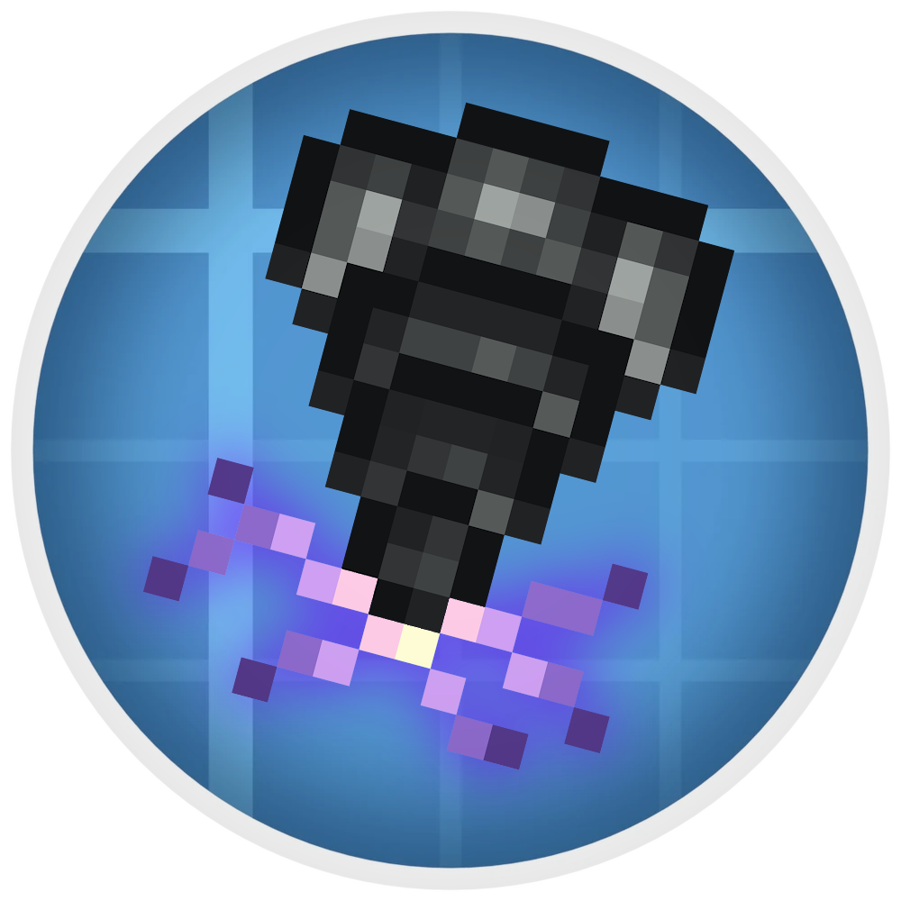

# Create: Rock & Stone 

Scan for rocks, mine out stones! **Create: Rock & Stone** aims to close the gap between Create and traditional factory game experience by bringing infinite mineable resource deposits into the world.

# Features

### Deposit Scanner 
Used to scan for underground ore deposits. Once you tuned onto a deposit, its antennas will periodically flash. If both antennas flash together, you are looking in the right direction. The faster they flash, the closer you are!    

### Miner Mk.1 
Mines resources from an underground deposit in a 3x3x1 area below. A deposit block can be claimed by only one miner at a time. The more deposit blocks a miner claims, the faster it mines the resource of that type.    

### Miner Mk.2 
An upgraded miner that can mine in a 3x3x5 area. On top of that, it can mine from advanced deposit types like redstone, zinc, etc.    

 <h3>Deposits</h3> 

# Credits

Models and textures for Miners Mk.1/Mk.2 and deposit scanner make partial use of Create assets. All used Create assets are licensed under the MIT license.
