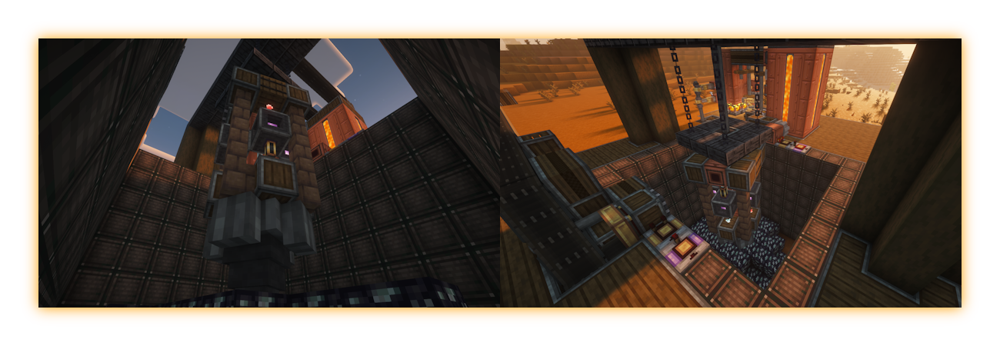

# Create: Rock & Stone 

**Create: Rock & Stone** aims to close the gap between Create and traditional factory game experience by bringing infinite mineable resource deposits into the world.
Make your own massive drill and cash in on the bounties of nature!

## FAQ

### Can I make a Datapack that does X?
Click [here](docs/datapack.md) to see what can be overridden with a datapack and how it's done.

### Can I make deposits spawn more often?
Yes, the mod provides 4 datapacks with preconfigured flavors. They can be selected when starting a new world in
the "datapacks" section or with a command: `/datapack enable "create_rns:<datapack>"`. \
If you'd like a fully custom option, consider [making your own datapack](docs/datapack.md).

## Credits

Models and textures for Miner Bearing and Deposit Scanner make partial use of Create assets. All used Create assets are licensed under the MIT license.
