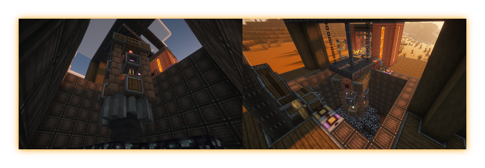

# Create: Rock & Stone 
&nbsp;&nbsp;
&nbsp;&nbsp;

**Create: Rock & Stone** aims to close the gap between Create and traditional factory game experience by bringing infinite mineable resource deposits into the world.
Make your own massive drill and cash in on the bounties of nature!

## How do I change how often deposits spawn in the world?
Create: Rock & Stone ships with pre-existing datapacks to tweak deposit worldgen, including one to disable deposit generation completely.

### New world
Datapacks can be added to a new world in a world creation screen. 

### Existing world
In an existing world, run `/datapack list` to see available datapacks and `/datapack enable "<datapack>"` to enable one. This will stop the generation of new deposits, but existing deposits will be untouched.

## What can I tweak?
* Add new custom deposits
* Change mined resources for existing deposits (mining recipe)
* Change mining speed
* Change Size of claimable area
* Add custom resonators, overclocks, and other catalysts
* Change existing catalysts
* Change spawn frequency of deposits (more granular than using a pre-existing datapack)
* Max scanning distance

All of the above can be tweaked with KubeJS (or a plain datapack).

## How do I tweak?
Please refer to your version of the mod:
#### [1.1.x (latest) - Minecraft 1.21.1](https://github.com/BMasta/create-rns/blob/1.21-1.1.x/docs/datapack.md)
#### [1.1.x (latest) - Minecraft 1.20.1](https://github.com/BMasta/create-rns/blob/1.20-1.1.x/docs/datapack.md)
#### [1.0.x - Minecraft 1.21.1](https://github.com/BMasta/create-rns/blob/1.21-1.0.x/docs/datapack.md)
#### [1.0.x - Minecraft 1.20.1](https://github.com/BMasta/create-rns/blob/1.20-1.0.x/docs/datapack.md)

## Credits
* Some models and textures in this mod make partial use of Create assets. All used Create assets are licensed under the [MIT license](https://github.com/Creators-of-Create/Create/blob/6cd9c9be090b2aece847df6783f9b55b358c5ad6/LICENSE)
* Uranium and lead deposit blocks make partial use of the respective ore blocks from Create Nuclear, and are licensed under the [MIT license](https://github.com/Create-Nuclear-Team/CreateNuclearNeoForge/blob/5201c55571e1a72438f3e31c781ee4f63943c3c3/LICENCE)
* Tin and silver deposit blocks make partial use of the respective ore blocks from Tech Reborn, and are licensed under the [MIT license](https://github.com/TechReborn/TechReborn/blob/2a5cd9573e0e9f81c93b49e3683e90a68804eb6f/LICENSE.md)
* Thorium deposit block makes partial use of the Thorium Ore block from Create New Age, and is subject to its [license](https://gitlab.com/antarcticgardens/create-new-age/-/blob/55ec599a0040a0123c69fbf07632a826f170ec27/LICENSE)
